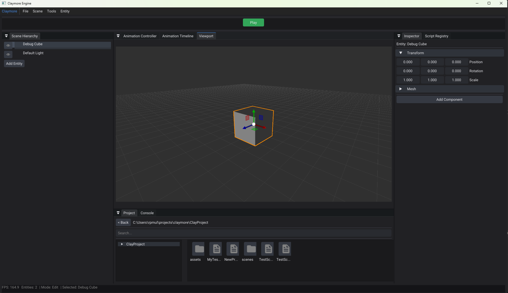

# claymore-engine
A 3D game engine developed in C++ with .NET 8.0 native interop; built on bgfx, assimp, and Jolt Physics



## Features
- **Cross-platform**: Runs on Windows (Linux TBA).
- **Graphics**: Uses bgfx for rendering, supporting multiple backends.
- **Physics**: Integrates Jolt Physics for realistic simulations.
- **Asset Management**: Utilizes Assimp for importing various 3D model formats.
- **Scripting**: Supports C# scripting with .NET 8.0 native interop.
  - HostCLR allows for modern LTS .NET SDK use, JIT compiling that makes scripts more performant than the traditional Mono/IL2CPP
- **Modular Design**: Engine components are designed to be modular and extensible.
- **Open Source**: Licensed under the MIT License, allowing for free use and modification.

## Getting Started
### Prerequisites
- **C++ Compiler**: A modern C++ compiler (e.g., GCC, Clang, MSVC).
- **.NET SDK**: .NET 8.0 SDK for C# scripting.
- **Dependencies**: Ensure you have the following libraries installed:
  - bgfx (must be built locally)   
  - Jolt Physics
  - Assimp
  - Dear ImGui - Docking branch
  - ImNodes
  - ImGuizmo
  - nlhomann/json
  - glm
  - [.NET 8.0.15 SDK](https://dotnet.microsoft.com/en-us/download/dotnet/8.0)
    
### Building 
- First navigate to ./scripts/ClaymoreEngine and run ```dotnet build``` to build the Managed engine binaries.
- Run CMake in the project root to build the native side, which will copy the managed binaries into the executable folder for interop at runtime.

## Example Script
```csharp
using ClaymoreEngine;
using System.Numerics;

public class TestScript : ScriptComponent
{
    public override void OnCreate()
   {
     Console.WriteLine("Made it to the start of OnCreate");
     Console.WriteLine("[MyTestScript] Referencing Entity" + refEntity.EntityID);     
     _ = DoAsyncMethod();
   }

// .NET 8.0 async/await capabilities
private async Task DoAsyncMethod()
   {
   Console.WriteLine("[MyTestScript] Made it to the start of the async function.");
   await Task.Delay(1000);
   Console.WriteLine("MyTestScript created successfully after 1 second!");
   await Task.Delay(5000);
   Entity newEntity = Entity.Create("MyTestEntity");
   Console.WriteLine("Created MyTestEntity");
     LightComponent l = newEntity.AddComponent<LightComponent>();
   l.Type = LightType.Point;
   l.Color = new Vector3(1, 0, 0);
   }

    public override void Update(float dt)
    {
        transform.position += new Vector3(0, 0, 1) * dt; // Move forward
    }
}
```
